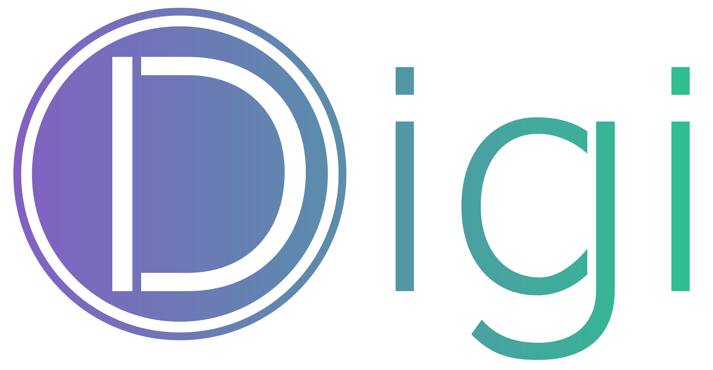

----

Digi is an open-source framework for building lightweight digital twins (or "digis") and running them in a cloud-native architecture. With Digi, users can easily create digital representations of real-world objects or systems, and program them using Python and configure them using a declarative API. The digis are also queryable for fast in-situ data analytics, and can be composed to model complex real-world interactions. Digi provides a flexible and scalable solution for building digital twins, and is a great starting point for anyone looking to explore the potential of digital twins.

One can use Digi to build _pervasive data apps_ consisting of digital twins for automation, data processing, and data analytics (e.g. in IoT, smart spaces, mobile) while orchestrating these apps at an appropriate scale, from a single node machine (Raspberry Pi, laptop) to a machine cluster in the cloud. Digi's runtime contains a collection of built-in "meta" digital twins, and users can easily extend the framework by adding new meta digis, in the same way as building the apps.

Digi is designed and implemented as an extension to [Kubernetes](https://github.com/kubernetes/kubernetes), where a digi's configurations and run-time states are stored in the Kubernetes apiserver, which can be accessed and managed using existing cloud-native tooling. Digi organizes data processing pipelines as _pipelets_ associated with each digi and leverages [Zed](https://github.com/brimdata/zed) to store and process the data generated or ingested by the pipelets.

----

## Getting started
To get started with Digi, run the following commands: `make dep` and `make install`. 

For more information on installation and frequently used commands, see the [quickstart page](docs/quickstart.md).

As a hello-world example, one can use Digi to build a control hierarchy and query the digis in a smart space:

## Resources
Here are some resources to help you learn more about Digi:
* [Quickstart guide](docs/quickstart.md)
* [Development guide](docs/development.md)
* [Building digis](docs/build-digi.md)

More information:
* [Digibox paper](https://people.eecs.berkeley.edu/~silvery/hotnets22-digibox.pdf)
* [dSpace paper](https://people.eecs.berkeley.edu/~silvery/sosp21-dspace.pdf)
* [Example digis](https://github.com/digi-project/examples)
* [Mock digis](https://github.com/digi-project/mocks)
* [Use cases and demo](https://github.com/digi-project/demo)
